# PACE — Implementation Plan (Capex release)

**PACE — Payment Approval and Control Engine.** *Approvals at PACE.*
Owner: JF&I Packaging. First release covers Capex for the Kenya entity. UAE and Bangladesh will be added through configuration.

The full brief is in [`docs/BRIEF.md`](docs/BRIEF.md). This plan says how it will be built. Decisions from the Phase 0 review are in [section 10](#10-decisions-phase-0-review-2026-09-25).

---

## 1. Verified technology baseline

Versions were checked on 2026-09-25 against Packagist (`repo.packagist.org/p2/*.json`), the `laravel/docs` repository on GitHub, the npm registry and Docker Hub official images. laravel.com and dev.mysql.com are blocked by this environment's network policy, so the Laravel support table comes from `laravel/docs@13.x/releases.md`, the same source that renders laravel.com/docs.

| Component | Version to use | Evidence / notes |
|---|---|---|
| Laravel framework | **13.x** (latest `v13.33.0`, 2026-09-22) | Laravel 13 was released 2026-03-17. Bug fixes until Q3 2027, security fixes until 2028-03-17. Requires PHP ^8.3. |
| Laravel skeleton | `laravel/laravel` v13.10.x | Used only to create the project. |
| PHP | **8.5** (latest `8.5.11`) | Laravel 13 supports PHP 8.3–8.5, so 8.5 is the newest supported. Every package below either accepts 8.5 or has no upper bound. Sail ships an 8.5 runtime. |
| MySQL | **9.7 LTS** recommended (8.4 LTS is the minimum) | Docker Hub's `mysql:lts` tag now points to **9.7.2**. `8.4.11` is the previous LTS. `26.x` is the Innovation track and is not suitable. Laravel supports MySQL 5.7+. The code will use only features available in both 8.4 and 9.7. The production choice depends on what the hosting provider supports (Q14). |
| Filament (admin) | **5.x** (`v5.8.4`) | Requires `illuminate/contracts ^11.28\|^12\|^13` and `livewire/livewire ^4.1`. |
| Livewire | **4.x** (`v4.4.6`) | Supports Laravel 13. |
| Tailwind CSS | **4.x** (`4.3.3`) | Filament 5 themes use Tailwind 4. Brand colours are defined as `@theme` tokens. |
| Vite | 8.x (`8.3.1`) | Laravel default build tool. |
| Alpine.js | 3.x (bundled with Livewire) | Not installed separately. |
| Node.js | 22 LTS (build time only) | Not needed at runtime. |
| `spatie/laravel-permission` | **8.x** (`8.3.0`) | Laravel 12/13, PHP ^8.3. Teams mode is on, with `team_id` = `entity_id`. |
| `spatie/laravel-activitylog` | **5.x** (`5.1.1`) | Laravel 12/13, **PHP ^8.4**, so this package alone rules out PHP 8.3. |
| `maatwebsite/excel` | **4.x** (`4.0.3`) | Laravel 12/13. Pulls in `phpoffice/phpspreadsheet ^5.9` (latest `5.10.0`). |
| `barryvdh/laravel-dompdf` | 3.x (`v3.1.2`) | Printable audit-trail PDF. Supports Laravel 13. |
| `pestphp/pest` (+ `pest-plugin-laravel`, `pest-plugin-livewire`) | **5.x** (`v5.2.1`) | PHP ^8.4. |
| `larastan/larastan` | **3.x** (`v3.12.2`) | Supports Laravel 13. Target **level 6** first, then raise it where practical. |
| `laravel/pint` | 1.x (`v1.32.1`) | Laravel preset. |
| `laravel/sail` | 1.x (`v1.68.0`) | Local Docker environment. The MySQL service image is pinned to the chosen LTS. |
| `brick/math` | (already a Laravel dependency) | `BigDecimal` for all money arithmetic. No floats. |

Other packages considered and rejected:
- **`spatie/laravel-settings`**: it has no clean way to override a group default per entity. A small in-house `Settings` service is simpler (section 3.7).
- **`stancl/tenancy` or Filament URL tenancy**: PACE uses one database with a row-level `entity_id`. Adding a second tenancy mechanism would give two sources of truth for the current entity (section 3.2).
- **`spatie/laravel-medialibrary`**: attachments need SHA-256 hashing, a scanning hook, random names and downloads served only by an authorising controller. A small `Attachment` model gives full control and is easier to audit.

Exact versions are fixed in `composer.lock` and `package-lock.json` in Phase 1. Constraints will use `^major.minor`.

---

## 2. Architecture overview

### 2.1 Shape
One **modular monolith** Laravel application, deployed as one codebase, with three runtime roles: **web**, **queue worker** and **scheduler**.

```
                ┌────────────────────────────────────────────────────────────┐
 Browser ──────▶│  Web (PHP-FPM / Octane-ready)                              │
                │   ├─ User app  /           Blade + Livewire 4 + Tailwind 4 │
                │   └─ Admin     /admin      Filament 5 panel                │
                │                                                            │
                │  Domain modules (app/Domain/*)                             │
                │   Core · Identity · MasterData · Budget · Workflow ·       │
                │   Capex · Documents · Notifications · Audit · Reporting    │
                │                                                            │
                │  Contracts (swap-in later)                                 │
                │   ErpConnector (Null) · AttachmentScanner (Null) ·         │
                │   ExchangeRateProvider (Table) · IdentityProvider (Local)  │
                └──────┬───────────────────┬──────────────────┬──────────────┘
                       │                   │                  │
                  MySQL 9.7/8.4       Private disk        SMTP (M365)
                  (data, sessions,    local → S3-compat.  via queued mail
                   jobs, cache)
                       ▲
       Queue worker ───┤  (mail, imports/exports, PDF, notifications)
       Scheduler ──────┘  (SLA reminders/escalations, delegation expiry, cleanups)
```

### 2.2 Key design principles
1. **Entity is first-class.** Every master-data and transactional table has `entity_id`. Isolation is enforced twice: by a global scope and by policies (section 3.2).
2. **Configuration, not code.** Approval paths, thresholds, quotation minimums, tolerances, number formats, password policy and SLA defaults are all data. Nothing branches on `entity.code === 'KE'`.
3. **Process-agnostic core.** The workflow engine, attachments, budget ledger, notifications and audit work on a polymorphic `subject` (`workflowable`, `attachable`). Capex is the first **Process module**. OpEx, Petty Cash and Courier will register their own `ProcessType`, request model, facts provider and form, and reuse everything else.
4. **Append-only where it matters.** Audit log, budget ledger, workflow action history and login history are insert-only. The application never updates or deletes these rows.
5. **Server is the source of truth.** Livewire actions and controllers re-load models through scoped queries and authorise every action. Client-sent IDs are never trusted.
6. **ERP-neutral.** POs and payments are raised in the entity's ERP. PACE stores their references and documents. An `ErpConnector` contract with a `NullErpConnector` default leaves room for an integration later.

### 2.3 UI choice (recommendation)
I recommend keeping the stack in the brief (Blade + Livewire + Tailwind for users, Filament for admins) with one refinement: **build user-app lists, forms and detail views from Filament's standalone packages** (`filament/tables`, `filament/forms`, `filament/infolists`, `filament/actions`) inside PACE's own Livewire pages and layout, instead of hand-writing tables and form widgets.

Reasons:
- It is one component vocabulary across admin and user app. Sorting, filtering, pagination, bulk actions, file uploads, repeaters (line items, quotations) and modals come with accessibility and validation already built in.
- There is less custom JavaScript, so less XSS and CSP exposure, and the Phase 7 security review has less to cover.
- The user app still has its own layout: the sidebar from section 13, the PACE branding, the entity switcher and the bell. So requesters and approvers never see an "admin panel".

The alternative is a second Filament panel for users, which would be faster to build. It would look like an admin tool, and custom dashboard layouts in it are harder. I don't recommend it, but it is a valid fallback if speed matters more than UX.

---

## 3. Cross-cutting design

### 3.1 Modules and their responsibilities
| Module | Owns |
|---|---|
| **Core** | `Entity`, `CurrentEntity` service, `BelongsToEntity` trait and `EntityScope`, `Settings`, money and FX value objects, number sequences, fiscal-year calculator, timezone display helpers, security-headers middleware. |
| **Identity** | Users, invitations and activation, login with entity selection, lockout, password history and expiry, sessions and force logout, login history, delegation records, roles and permissions (Spatie teams). `IdentityProvider` seam for Entra ID later. |
| **MasterData** | Departments, Cost Centres, Profit Centres, GL Accounts (typed), Internal Orders, Vendors (encrypted bank details), Payment Terms, Budget Codes, Board Papers, Currencies, Exchange Rates, Capex Categories. Generic import and export pipeline with row-level error reports. |
| **Budget** | Budgets with 12 monthly allocations, an append-only ledger, the availability calculator and budget-check snapshots. |
| **Workflow** | Definitions and versions, selection rules, steps, conditions, assignee resolvers, instances with snapshot, tasks, actions, segregation-of-duties guard, delegation resolution, SLA tracking, simulator. |
| **Capex** | Capex request, line items, quotations, POs, invoices and payments. `CapexFactsProvider` feeds workflow conditions. Lifecycle services: Submit, Resubmit, Cancel, Close. Capex form and pages. |
| **Documents** | `Attachment` model, private-disk storage, allow-list and size validation, SHA-256 hash, scanner hook, authorised download controller. |
| **Notifications** | Notification classes (mail + database, queued), bell component, deep links. |
| **Audit** | Extended activity-log model (entity, IP, user agent, on-behalf-of), append-only guard, audit viewer and export, per-request audit PDF. |
| **Reporting** | Dashboard widgets (role-aware), Excel reports, group consolidation in the reporting currency. |

### 3.2 Multi-entity isolation
- **`CurrentEntity`** (request-scoped singleton) is set by `EnsureEntitySelected` middleware from `session('entity_id')`. It re-checks on every request that the user still has access to the entity. It also calls `setPermissionsTeamId($entityId)` so Spatie resolves roles per entity.
- **`BelongsToEntity` trait** on every entity-owned model:
  - adds `EntityScope` (a global scope `where entity_id = current`);
  - on `creating`, sets `entity_id` from `CurrentEntity` and refuses any mismatched value;
  - makes `entity_id` non-fillable, so a client can never set or change it.
- **Group Super Admin** is a global role (Spatie role with `team_id = null`, resolved through a dedicated check). `Gate::before` grants all abilities. The scope stays on: a super admin still works in one selected entity at a time, and consolidated group reports use explicit, audited `withoutEntityScope()` queries in the Reporting module only.
- **Policies** exist for every model. Each checks that the permission is held in the current team and that `model.entity_id === current`. The second check is the defence in depth if a scope is ever bypassed.
- **Route model binding** resolves through the scoped query. A foreign ID returns **404**, not 403, so it does not reveal that the record exists.
- **Queued jobs** carry `entity_id` explicitly and restore `CurrentEntity` in job middleware. Jobs never rely on the session.
- **Isolation test suite** (Pest, dataset-driven): for every resource, list, view, update, Livewire action, export, attachment download and notification deep link, tested as a user of entity A against entity B IDs. It must return 404 or 403 and change nothing.

### 3.3 Authentication
- Login page fields: email, password and entity. The entity dropdown lists **all active entities**, not only the user's, so the form does not leak memberships. The check is one step: the credentials are valid, the account status is Active, the account is not locked, and the user has access to the chosen entity. Any failure shows the same message: *"These details don't match our records."*
- **Lockout:** `failed_attempts` and `locked_until` on the user (5 attempts and 15 minutes by default, both configurable), plus a per-IP-and-email rate limiter on the endpoint. Admins can unlock. Lockout and unlock are audited.
- **Activation:** an admin creates the user with status `invited`. On the Sign Up page the user enters their email. If the email matches an invited user in an allowed domain, a **signed temporary URL** (60 min by default) is emailed. The response is always the same neutral message. Setting the password changes the status to `active`. Optional self-registration (off by default) creates the user as `pending_approval`.
- **Passwords:** `Password::min(12)->mixedCase()->numbers()->symbols()`, plus `->uncompromised()` when enabled. A `password_histories` table blocks reuse of the last 5 (bcrypt/argon hashes compared with `Hash::check`). Password expiry is optional.
- **Sessions:** database driver, and a `user_id`-indexed `sessions` table lets admins revoke one session or all of them. An idle-timeout middleware reads the setting (30 min by default) and is independent of `SESSION_LIFETIME`. Session ID is regenerated on login and on entity switch. Entity switch is audited.
- **Login history:** a `login_events` table (user id if known, email tried, result, reason code kept internal, IP, user agent, entity, timestamp). It is append-only.
- **SSO-ready:** users have `auth_provider` (`local` now) and a nullable `external_id`. The login flow sits behind an `IdentityProvider` interface, so an Entra ID (Socialite) provider can be added later without schema changes.

### 3.4 Workflow engine
**Definitions** are versioned. Editing an Active definition clones it into a new Draft version. Activating it retires the previous version on its effective date. **Selection rules** (category, department, amount band in base currency) choose among the active definitions for an entity and process. Ties are broken by `priority`, then by the most recent `effective_from`. If no definition matches, submission is blocked and the entity admin is notified.

**At submission** the engine:
1. Builds a **facts** array from the process module's `FactsProvider`: `amount_base`, `budget_status`, `quotation_count`, `quotation_below_min`, `category_id`, `department_id`, `cost_centre_id`, `has_board_paper` and `requester_id`. The contract allows more facts per process later.
2. Selects the definition and **snapshots** it as JSON on `workflow_instances.definition_snapshot`, with the version id.
3. Evaluates each step's **conditions**. They are stored as structured JSON (`{field, operator, value}` groups with AND/OR) and evaluated by a small registry of typed operators. There is no `eval` and no expression language. Steps that fail are recorded as **Skipped** with the reason.
4. **Resolves assignees** for every applicable step through `AssigneeResolver` strategies: specific users, role in entity, HoD of the request's department, owner of the request's cost centre, the requester's line manager, or a user chosen by the previous actor from an allowed list. Delegation is applied at resolution time and again at action time. If any applicable step resolves to nobody (other than a "chosen by previous actor" step, which is checked when that choice is made), submission is **blocked** with the step named, and the entity admin is notified.
5. Opens the first step and creates **tasks** (one per assignee). The mode is *any* (the first action closes the step) or *all* (every task must approve).

**Actions:** Approve, Reject, Return to Requester, Return to Previous Step, Request Information. A comment is required for Reject, any Return and Request Information. **Action steps** complete through their specific form (Upload PO, Upload Invoice, Record Payment). **Information** steps notify and auto-advance. **Editable fields** per step are an allow-list of field keys. Every edit is audited with before and after values.

**Segregation of duties** (`SodGuard`, checked at resolution time, so the requester is never assigned, and again at action time):
- The requester can never act on an Approval or Validation step of their own request.
- The same person cannot act on two approval steps of one request, unless the step sets `allow_same_actor`.
- The payment recorder must not be the final approver. The response is configurable as `block` (default) or `warn`, and a warning override is audited.

Delegation does not get around SoD: a delegate who is also the requester is still blocked.

**Delegation:** `delegations (user_id, delegate_id, starts_at, ends_at, process_type nullable, reason)`. Actions record both `actor_id` and `on_behalf_of_id`, and the timeline reads *"Approved by X on behalf of Y"*. Admins can reassign any pending task (audited, with a reason).

**Return and resubmit:** the default is to restart from the first step. A per-definition flag `restart_on_resubmit` can make it resume at the returning step. On resubmit the facts are re-evaluated and the budget re-checked, and a fresh instance *cycle* is created. The history of earlier cycles is kept.

**PO over-tolerance:** when a PO is uploaded, if `po_amount_base > approved_amount_base × (1 + tolerance%)`, the engine inserts the definition's configured **re-approval step** (a step with the `po_reapproval` trigger) before continuing.

**SLA:** each task has `due_at`, calculated from the step's SLA hours. A scheduled job runs every 15 minutes and sends reminders at the step's frequency. When a task is overdue it escalates to the configured user or role. Whether SLA counts calendar or business hours is Q18.

**Simulator:** in Filament, the admin enters amount, currency, department, category, cost centre, budget status, quotation count and board-paper flag, and sees the selected definition, the step list with applied or skipped reasons, and the named assignees after delegation. It uses the same engine code path in dry-run mode.

**Designer: an interactive process map** (confirmed in the Phase 0 review). It is a Filament page that draws the workflow as a flowchart:
- **Nodes** are step cards showing the type icon, name, assignee rule and SLA. The Start node is Request Creation and the End node is Completed.
- A step with conditions shows as a **conditional branch**: a diamond labelled "applies if …" with a bypass line around it. Parallel "all assignees" steps show stacked avatars. Return paths (to requester or previous step) show as dashed back-arrows. Trigger-only steps, such as PO re-approval, hang off the step that triggers them.
- **Editing happens on the map.** Drag a node to reorder it. Use the "+" on any connector to insert a step. Click a node to open a side panel that edits its type, assignee rule, mode, conditions, allowed actions, editable fields, SLA and escalation. Roles can be created from the panel without leaving the map.
- **The simulator is drawn on the map.** Enter sample values and the resolved path lights up: skipped steps grey out and each node shows the named assignee.
- **Actions:** Clone definition, New version, and Activate. Activate runs a validation pass, for example rejecting a condition with no value or an assignee rule that resolves to nobody.
- **Implementation:** Livewire 4 plus Alpine, SortableJS for drag-and-drop, and an SVG connector layer. There is no React and no BPMN library, which keeps it CSP-friendly and inside the existing stack. The map edits the ordered-steps model described above, where conditions give branching and "all" mode gives parallel approval. That covers every route in the source process without the risk of a free-form graph engine. If you later need routes that split and merge, the engine's step model can move to a graph without changing the UI concept.
- A clickable mockup will be shared for sign-off before Phase 4 starts.

### 3.5 Budgets
- `budgets (entity_id, fiscal_year, budget_code_id, cost_centre_id, annual_amount)` with `budget_allocations (budget_id, period 1–12, amount)`. The sum of the allocations must equal the annual amount.
- `budget_ledger_entries` are append-only: `type` (commitment, release, adjustment, actual, transfer), `amount` (signed), `source_type/source_id`, `period` and `occurred_at`.
- **Available** = allocation (annual or YTD, set per entity, Q4) − commitments net of releases and adjustments − actuals. It is calculated by the query in `BudgetAvailability`, and optionally cached per request cycle.
- **Commit** happens on submission or on final approval (setting, Q5). **Release** happens on reject or cancel. **Adjust** to the PO value when the PO is uploaded. **Convert to actual** when payment is recorded (a release of the commitment plus an actual for the paid amount).
- The budget-check result (`within`, `exceeds`, `none`) is snapshotted on the request at submission, together with the figures used.

### 3.6 Numbers, money and time
- **Request numbers** come from `number_sequences (entity_id, process_type, fiscal_year, next_value)`, locked with `SELECT … FOR UPDATE` inside the submit transaction. They are **assigned at first submission**, which keeps them gap-free. Drafts show a draft reference such as `DRAFT-7F3K`. The format template is configurable, and the default is `{entity}-{process}-FY{fy2}-{seq:5}` → `KE-CPX-FY27-00001`. A concurrency test uses parallel submissions.
- **Money:** `DECIMAL(18,2)` columns, a `MoneyCast` to `Brick\Math\BigDecimal`, and rounding `HALF_UP` to 2 dp. FX rates are `DECIMAL(18,6)`, effective-dated per entity and currency pair. **Currencies** form a group-wide ISO 4217 list, seeded with KES, AED, BDT, USD, EUR, GBP, CHF, LKR, INR, CNY and JPY. Each entity chooses which currencies are enabled for transactions. Requests, quotations, POs, invoices and payments can each be in any enabled currency, with the base amount calculated from the effective rate. Group rates, used to convert into the **USD** reporting currency, are held as rates with no entity. The base amount is calculated on the server, and the rate used is snapshotted on the request.
- **Time:** `APP_TIMEZONE=UTC` and the DB stores UTC. The display helper (`@datetime($ts)`, a Carbon macro) converts to the current entity's timezone. Kenya is `Africa/Nairobi`. The fiscal year is calculated from the entity's `fy_start_month`.

### 3.7 Settings
`settings (entity_id nullable, key, value JSON, updated_by)`. A NULL `entity_id` row is the group default, and an entity row overrides it. Access goes through the typed `Settings::get('password.min_length', entity)` with a cache that is cleared on write. Every change is audited. The keys are defined in one `SettingsRegistry` class with types, defaults and validation, and that class generates the Filament settings form.

### 3.8 Documents
- Stored on the `documents` disk (`local` private in dev, S3-compatible in prod) at `entity/{id}/{yyyy}/{mm}/{uuid}`. The original filename is kept only in the DB.
- The allow-list checks both extension **and** detected MIME type (PDF, JPG, PNG, XLSX, DOCX, MSG). The size limit comes from settings (default 10 MB).
- A SHA-256 hash is stored for each file. `AttachmentScanner::scan()` runs on upload. The `Null` implementation marks the file clean. A ClamAV implementation can be added later, and files not yet scanned or found infected cannot be downloaded.
- Files are downloaded only through `AttachmentController@download`. It checks the policy on the parent model, streams the file with `Content-Disposition: attachment` and `X-Content-Type-Options: nosniff`, and logs the download.

### 3.9 Audit
- `spatie/laravel-activitylog`, with the table extended by `entity_id`, `ip`, `user_agent`, `on_behalf_of_id` and `request_id`. A custom `Activity` model throws on `updating` and `deleting`.
- Models use `LogsActivity` and log only dirty fields with old and new values. Encrypted and secret fields are masked (`bank_account` → `****1234`, passwords never).
- Explicit events cover login, logout, entity switch, workflow actions, admin actions, settings changes, exports and downloads.
- **Database hardening (documented):** the app DB user has `SELECT, INSERT` only on `activity_log`, `login_events`, `budget_ledger_entries` and `workflow_actions`. A separate migration user owns DDL. Retention purges run as a separate privileged job, if any retention period is agreed (Q17).

### 3.10 Security baseline (built from Phase 1, verified in Phase 7)
CSRF (Laravel default), Blade escaping (no `{!! !!}` on user data), `$fillable` on every model with `Model::shouldBeStrict()` in non-production, bindings only (no raw user input in `DB::raw`), rate limits on login, sign-up, forgot-password and activation. A security-headers middleware sets CSP (nonce-based and compatible with Livewire and Filament, verified in Phase 7), HSTS, `X-Frame-Options: DENY`, `Referrer-Policy: strict-origin-when-cross-origin`, `Permissions-Policy` and `X-Content-Type-Options`. Secure, HttpOnly and SameSite=Lax cookies. `APP_DEBUG=false` and HTTPS forced in production. Encrypted casts for vendor bank details, masked in the UI unless the user has `vendors.view_bank_details`.

### 3.11 Extensibility seams
| Seam | Default implementation | Future |
|---|---|---|
| `ErpConnector` (createPo, fetchPoStatus, postPayment, …) | `NullErpConnector` (no-op, returns `null`) | SAP, Dynamics, etc. per entity via settings |
| `AttachmentScanner` | `NullAttachmentScanner` | ClamAV / cloud AV |
| `ExchangeRateProvider` | `TableExchangeRateProvider` | Bank feed |
| `IdentityProvider` | `LocalPasswordProvider` | Microsoft Entra ID |
| `ProcessType` registry | `capex` | `opex`, `petty_cash`, `courier` |

---

## 4. Entity relationship diagram

The diagram shows the core tables. Audit columns (`created_by`, `updated_by`, timestamps) and some master tables are left out for readability. Every table marked **E** has `entity_id`.

```mermaid
erDiagram
    ENTITIES ||--o{ ENTITY_USER : grants
    USERS ||--o{ ENTITY_USER : "has access"
    USERS ||--o{ MODEL_HAS_ROLES : "roles per entity (team_id)"
    ROLES ||--o{ MODEL_HAS_ROLES : ""
    ROLES ||--o{ ROLE_HAS_PERMISSIONS : ""
    PERMISSIONS ||--o{ ROLE_HAS_PERMISSIONS : ""
    USERS ||--o{ PASSWORD_HISTORIES : ""
    USERS ||--o{ LOGIN_EVENTS : ""
    USERS ||--o{ DELEGATIONS : "delegator / delegate"
    USERS }o--o| USERS : "line manager"
    ENTITIES ||--o{ SETTINGS : "overrides"

    ENTITIES ||--o{ DEPARTMENTS : E
    USERS ||--o{ DEPARTMENTS : "head of dept"
    ENTITIES ||--o{ COST_CENTRES : E
    DEPARTMENTS ||--o{ COST_CENTRES : ""
    USERS ||--o{ COST_CENTRES : owner
    ENTITIES ||--o{ PROFIT_CENTRES : E
    ENTITIES ||--o{ GL_ACCOUNTS : "E (type: capex/opex/...)"
    ENTITIES ||--o{ INTERNAL_ORDERS : E
    ENTITIES ||--o{ VENDORS : "E (bank details encrypted)"
    ENTITIES ||--o{ PAYMENT_TERMS : E
    ENTITIES ||--o{ BUDGET_CODES : E
    ENTITIES ||--o{ BOARD_PAPERS : E
    ENTITIES ||--o{ CAPEX_CATEGORIES : E
    CURRENCIES ||--o{ EXCHANGE_RATES : "from/to"
    ENTITIES ||--o{ EXCHANGE_RATES : "E, effective-dated"

    ENTITIES ||--o{ BUDGETS : E
    BUDGET_CODES ||--o{ BUDGETS : ""
    COST_CENTRES ||--o{ BUDGETS : ""
    BUDGETS ||--|{ BUDGET_ALLOCATIONS : "12 periods"
    BUDGETS ||--o{ BUDGET_LEDGER_ENTRIES : "append-only"

    ENTITIES ||--o{ WORKFLOW_DEFINITIONS : "E, process_type, version"
    WORKFLOW_DEFINITIONS ||--o{ WORKFLOW_SELECTION_RULES : ""
    WORKFLOW_DEFINITIONS ||--|{ WORKFLOW_STEPS : ordered
    WORKFLOW_STEPS ||--o{ WORKFLOW_STEP_CONDITIONS : ""
    WORKFLOW_STEPS ||--o{ WORKFLOW_STEP_ASSIGNEE_RULES : ""
    WORKFLOW_DEFINITIONS ||--o{ WORKFLOW_INSTANCES : "snapshot json"
    WORKFLOW_INSTANCES ||--|{ WORKFLOW_INSTANCE_STEPS : "applied/skipped"
    WORKFLOW_INSTANCE_STEPS ||--o{ WORKFLOW_TASKS : "per assignee"
    WORKFLOW_INSTANCE_STEPS ||--o{ WORKFLOW_ACTIONS : "append-only"
    USERS ||--o{ WORKFLOW_TASKS : assignee
    USERS ||--o{ WORKFLOW_ACTIONS : "actor / on behalf of"

    ENTITIES ||--o{ CAPEX_REQUESTS : E
    USERS ||--o{ CAPEX_REQUESTS : requester
    CAPEX_REQUESTS ||--o| WORKFLOW_INSTANCES : "workflowable (morph)"
    CAPEX_REQUESTS }o--|| DEPARTMENTS : ""
    CAPEX_REQUESTS }o--|| COST_CENTRES : ""
    CAPEX_REQUESTS }o--|| GL_ACCOUNTS : ""
    CAPEX_REQUESTS }o--|| BUDGET_CODES : ""
    CAPEX_REQUESTS }o--|| CAPEX_CATEGORIES : ""
    CAPEX_REQUESTS }o--o| BOARD_PAPERS : ""
    CAPEX_REQUESTS ||--o{ CAPEX_LINE_ITEMS : ""
    CAPEX_REQUESTS ||--o{ QUOTATIONS : "min N"
    VENDORS ||--o{ QUOTATIONS : ""
    CAPEX_REQUESTS ||--o{ PURCHASE_ORDERS : ""
    PURCHASE_ORDERS ||--o{ INVOICES : ""
    VENDORS ||--o{ INVOICES : "unique (entity,vendor,number)"
    INVOICES ||--o{ PAYMENTS : ""
    CAPEX_REQUESTS ||--o{ BUDGET_LEDGER_ENTRIES : "source (morph)"

    ATTACHMENTS }o--|| ENTITIES : E
    CAPEX_REQUESTS ||--o{ ATTACHMENTS : "attachable (morph)"
    NUMBER_SEQUENCES }o--|| ENTITIES : "per process + FY"
    ACTIVITY_LOG }o--o| ENTITIES : "append-only"
```



Main columns (the rest will be finalised in each phase's migrations):
- **entities**: `code` (unique), `name`, `country`, `base_currency`, `timezone`, `fy_start_month`, `request_prefix`, `allowed_email_domains` (JSON), `is_active`.
- **users**: `name`, `email` (unique, global), `designation`, `department_id` (nullable; per entity through a pivot if needed), `line_manager_id`, `status` (invited, pending_approval, active, locked, deactivated), `failed_attempts`, `locked_until`, `password_changed_at`, `auth_provider`, `external_id`, `last_login_at`.
- **entity_user**: `entity_id`, `user_id`, `is_home` (the requester's operating entity; group users have none), `granted_by`, `granted_at`.
- **capex_requests**: `entity_id`, `request_number` (nullable until submit, unique per entity), `draft_ref`, `requester_id`, `status`, `current_step_name`, FK set, `title`, `description`, `justification`, `required_by`, `currency`, `fx_rate`, `amount`, `amount_base`, `budget_status`, `budget_snapshot` (JSON), `sole_source_justification`, `recommended_quotation_id`, `recommendation_reason`, `fiscal_year`, `submitted_at`, `completed_at`, `closed_reason`.

---

## 5. Folder structure

```
app/
  Domain/
    Core/            Models/Entity.php, Support/CurrentEntity.php, Scopes/EntityScope.php,
                     Concerns/BelongsToEntity.php, Settings/, Money/, Numbering/, FiscalYear/
    Identity/        Models/, Actions/ (InviteUser, ActivateUser, SwitchEntity, ...),
                     Auth/ (IdentityProvider, LocalPasswordProvider), Rules/ (NotRecentlyUsed)
    MasterData/      Models/, Imports/, Exports/, Import/ (RowValidator, ErrorReport)
    Budget/          Models/, Services/ (BudgetAvailability, BudgetLedger), Enums/
    Workflow/        Models/, Engine/ (WorkflowEngine, DefinitionSelector, ConditionEvaluator,
                     Operators/, Resolvers/, SodGuard, Simulator), Contracts/ (FactsProvider,
                     AssigneeResolver), Enums/, Events/
    Capex/           Models/, Actions/ (SubmitCapexRequest, ...), Facts/CapexFactsProvider.php,
                     Policies/, Enums/
    Documents/       Models/Attachment.php, Contracts/AttachmentScanner.php, Scanners/
    Notifications/   Notifications/ (TaskAssigned, RequestApproved, ...)
    Audit/           Models/Activity.php, Support/
    Reporting/       Reports/, Widgets/
    Integrations/    Erp/ (ErpConnector.php, NullErpConnector.php)
  Filament/
    Admin/           Resources/ (Entities, Users, Roles, MasterData/*, Budgets, Workflows,
                     AuditLog), Pages/ (Settings, WorkflowSimulator), Widgets/
  Http/
    Controllers/     AttachmentController, Auth/*
    Middleware/      EnsureEntitySelected, IdleTimeout, SecurityHeaders, SetEntityTeam
  Livewire/          Dashboard/, Capex/ (Index, Form, Show, Timeline, TaskPanel), Shared/ (Bell,
                     EntitySwitcher, BudgetPanel)
  Policies/          (one per model; register via Gate auto-discovery)
  Providers/
config/pace.php      (defaults that seed the settings table; no secrets)
database/
  migrations/  factories/  seeders/ (EntitySeeder, KenyaMasterDataSeeder, RolesAndPermissionsSeeder,
                                      DemoUsersSeeder, KenyaCapexWorkflowSeeder, SampleBudgetSeeder)
resources/
  css/app.css         (Tailwind 4 @theme tokens: --color-brand-*)
  views/layouts/      (app.blade.php with sidebar; guest.blade.php for login/sign-up)
  views/components/   views/livewire/  views/pdf/
routes/  web.php  auth.php  console.php (scheduler)
tests/
  Feature/{Auth,Isolation,MasterData,Budget,Workflow,Capex,Documents,Reporting}/
  Unit/{Money,FiscalYear,Conditions,Numbering}/
  Pest.php  (helpers: actingInEntity(), makeEntity(), ...)
docs/  BRIEF.md  DEPLOYMENT.md  BACKUP_RESTORE.md  SECURITY.md  DATA_PROTECTION.md
docker-compose.yml (Sail)   phpstan.neon   pint.json   PLAN.md   CLAUDE.md   README.md
```

---

## 6. Roles and permissions (initial seed)

The roles are per entity (Spatie team = entity): **Entity Admin, Requester, Approver, Budget Approver, Validator, Validation Approver, Coordinator, Purchasing, Additional Authoriser, Payment Team, Payment Team Manager, Viewer/Auditor**. **Group Super Admin** is global. These are seed data only. Admins can create, rename and deactivate roles, and choose any of them as a step assignee.

Permissions are named `{area}.{action}`, for example `capex.create`, `capex.view_own`, `capex.view_all`, `capex.cancel_any`, `capex.edit_fx_rate`, `vendors.view_bank_details`, `masterdata.manage`, `budgets.manage`, `workflows.manage`, `users.manage`, `audit.view`, `reports.export`, `payments.record` and `requests.close`. Workflow step assignment uses **roles**. Screen access uses **permissions**. Admins can create roles and edit permission sets.

---

## 7. Default Kenya Capex workflow (seed)

The seed is a **starting template, not fixed logic**. It is created as a **Draft** definition. The admin assigns real users to the roles, fills in the Additional Authorisation amount, adjusts steps on the process map, and then activates it. Activation is refused while any condition value or assignee is still empty. All roles below are ordinary, editable roles, and admins can rename them, add more, or change which role each step uses.

| # | Step | Type | Assignee rule (seeded) | Condition | Notes |
|---|---|---|---|---|---|
| 1 | Request Creation | (start) | Requester | — | Minimum 3 quotations, or a sole-source justification |
| 2 | Budget Approval | Approval | Role: Budget Approver | `budget_status in (exceeds, none)` | |
| 3 | Validation | Validation | Role: Validator | — | Editable: GL account, cost centre, budget code |
| 4 | Validation Approval | Approval | Role: Validation Approver | — | |
| 5 | HoD Approval | Approval | HoD of request department | — | Moved before the coordinator (Phase 0 decision) |
| 6 | Pending Coordinator | Review | Role: Coordinator | — | Editable: vendor confirmation |
| 7 | Purchasing – Upload PO | Action (Upload PO) | Role: Purchasing | — | PO tolerance check → re-approval step |
| 8 | Additional Authorisation | Approval | Role: Additional Authoriser | `amount_base > (set by admin)` | Amount left blank; must be set before activation |
| 9 | Invoice Upload & Approved Invoice List | Action (Upload Invoice) | Role: Payment Team | — | Assignee changeable on the map |
| 10 | Payment Team Manager Review | Review | Role: Payment Team Manager | — | |
| 11 | Payment Processing | Action (Record Payment) | Role: Payment Team | — | SoD: not the final approver |
| 12 | Completed | (end) | — | — | Read-only, archived |
| (x) | PO Re-approval | Approval | Role: Additional Authoriser | Triggered when PO > approved + tolerance | Not in the normal sequence |

## 8. Phase plan

Each phase ends with a summary, run and test instructions, the decisions needed from you, and a commit. The Pint, Larastan and Pest gates must pass at the end of every phase from Phase 1 on.

### Phase 0 — Plan *(this deliverable)*
`PLAN.md`, `CLAUDE.md`, `docs/BRIEF.md`, and the questions in section 10. No code.

### Phase 1 — Foundation *(delivered 2026-09-25)*
Delivered as described below, with two changes: bulk user import from Excel moved to Phase 2 (it uses the generic import pipeline built there), and the audit log export is CSV until the reporting module adds Excel.
- Laravel 13 project (`composer.json` requires PHP ^8.4; the Sail runtime and production run 8.5). Sail with MySQL (per Q14), Mailpit and optional Redis. Pint, Larastan and Pest configured. GitHub Actions CI (lint, static analysis, tests on MySQL).
- Core: `entities`, `CurrentEntity`, `BelongsToEntity` and scope, settings service and registry, security headers, idle timeout, timezone display helpers.
- Identity: users, entity access, Spatie permission with teams, roles and permissions seed, login with entity selection, generic errors, lockout and unlock, rate limiting, sign-up and activation (signed link), optional self-registration flag, forgot and reset password, password policy and history, optional expiry, database sessions with force logout, login history, entity switcher (audited).
- Filament admin panel: Entities (super admin), Users (create, invite, resend, reset link, lock and unlock, deactivate, force logout, login history, delegate field), Roles and Permissions, System Settings (auth-related keys), Audit Log viewer (basic).
- Audit base: extended activity log, append-only guard, auth and admin events.
- User app shell: PACE layout, sidebar with disabled "Coming soon" items, brand tokens, and an empty dashboard.
- **Tests:** login with entity selection, generic failure message, lockout and unlock, activation happy path and neutral responses, password rules and history, entity switch, isolation for users and entities, append-only audit.

### Phase 2 — Master data *(delivered 2026-09-25)*
Delivered as described below, plus bulk user import, entity settings (minimum quotations) and a currency list with per-entity enablement. Decisions made during the build: imports are all-or-nothing; payment roles maintain vendor bank details; group reporting-currency rates move to Phase 6; the S3 driver package (`league/flysystem-aws-s3-v3`) is installed when hosting is chosen.
All master tables from section 3.1 with Filament CRUD, deactivate-only (a delete guard when referenced), a GL account type flag, cost-centre owner and department, encrypted and masked vendor bank details, board papers with attachments (Documents module delivered here), effective-dated exchange rates. A generic Excel import pipeline (queued, row-level validation error report downloadable as XLSX) and exports. Kenya sample master data seeder.
**Tests:** CRUD policies, isolation, deactivate guard, import validation report, bank detail masking and encryption, FX lookup by date, attachment upload rules and authorised download.

### Phase 3 — Budgets
Budgets with 12 allocations, Excel import, the ledger service (commit, release, adjust, actual, transfer), availability (annual or YTD setting), a Filament budget view with ledger drill-down, and a sample budget seeder.
**Tests:** allocation sum rule, availability under both modes, each ledger transition, ledger append-only, fiscal-year boundaries.

### Phase 4 — Workflow engine
Definitions, versioning and snapshots, selection rules, steps, conditions, assignee resolvers, SoD guard, delegation, instance, task and action models, the engine API (`start`, `act`, `reassign`, `insertReapproval`), the **process-map designer** (drag to reorder, insert on a connector, side-panel step editor, clone, new version, activate with validation) with the simulator drawn on the map. Mockup sign-off comes before the build. Default Kenya Capex workflow seed. The engine is tested against a **test-only fake process**, so it is proven to be process-agnostic before Capex exists.
**Tests:** condition operators, skip logging, each resolver, unresolved-assignee block and admin notification, any versus all mode, SoD (all three rules plus the allow flag), delegation and "on behalf of", versioning (in-flight requests keep their snapshot), definition selection by priority, simulator parity with the real run.

### Phase 5 — Capex lifecycle
Capex request form (Livewire and Filament form components): line items, FX auto-fill and permission-gated edit, live budget panel, quotations with the recommended one, sole-source justification, typed supporting documents, draft and submit. Submission service (budget snapshot, commitment per setting, workflow start, gap-free number). Show page with timeline and task panel (approve, reject, return, request info, editable fields). PO upload with tolerance re-approval, invoices (duplicate check, over-PO override audited), payments (SoD), completion when paid in full, manual close by Finance, cancel rules, return and resubmit, read-only archive.
**Tests:** full happy path, return and resubmit, reject (budget release), cancel before first approval and by admin, PO tolerance, duplicate invoice, invoice over PO, payment SoD, concurrent numbering, isolation on every Livewire action and download.

### Phase 6 — Visibility
Notifications (all events in brief section 12, mail plus database, queued, deep links), bell, SLA reminders and escalation (scheduler), delegation set and used notices. A designed home screen and interactive, role-aware dashboards (charts with hover and drill-down to the underlying requests; pastel palette), with a mockup for sign-off first. Widgets from brief section 13, and a group consolidated view in the reporting currency. Excel reports (Capex register, pending approvals ageing, budget vs committed vs actual, turnaround by step and approver) and the audit-trail PDF.
**Tests:** notification dispatch per event, SLA reminder and escalation timing (time travel), widget figures, report contents, export isolation.

### Phase 7 — Hardening
A security review against brief section 14 and the OWASP Top 10 (CSP tuned, headers verified, dependency audit with `composer audit` and `npm audit`), a full test pass, raising the Larastan level, performance testing with realistic volumes (for example 50k requests, 500 users, 3 entities: indexes, N+1 checks, dashboard query timing), and data retention jobs. Documentation: README, `docs/DEPLOYMENT.md` (Linux VM and container, Nginx, PHP-FPM or Octane, Supervisor or systemd for queue and scheduler, TLS, env vars), `docs/BACKUP_RESTORE.md` (daily `mysqldump --single-transaction` or managed snapshots, object-storage versioning, a quarterly restore test procedure), `docs/SECURITY.md` (DB user grants, secrets, pen-test readiness checklist) and `docs/DATA_PROTECTION.md` (Kenya DPA 2019, Sri Lanka PDPA No. 9 of 2022).

---

## 9. Testing and quality gates
- `./vendor/bin/pint --test`, `./vendor/bin/phpstan analyse` (level ≥ 6), and `./vendor/bin/pest --parallel`, run on MySQL, not SQLite, so locking and JSON behaviour match production.
- The coverage list in brief section 16 is the minimum. Each item is mapped to a phase above.
- Seeders give one demo user per role, with credentials documented **for local use only**. The seeders refuse to run when `APP_ENV=production`.

---

## 10. Decisions (Phase 0 review, 2026-09-25)

| # | Topic | Decision |
|---|---|---|
| 1 | Onboarding | Admin pre-creates users, and they activate through Sign Up. Self-registration is off. |
| 2 | Email domains | `jfi.lk` only (confirmed again after Phase 1). Domains are a setting per entity, so adding one later is configuration. |
| 3 | Financial year | April–March for Kenya. `FY27` = the year ending March 2027. |
| 4 | Budget basis | Annual allocation (the setting also supports YTD). |
| 5 | Commitment | On submission. |
| 6 | Additional Authorisation amount | Not seeded. Set by the admin on the process map before activation. |
| 7 | HoD Approval | Before Pending Coordinator. Configurable. |
| 8 | Kenya ERP | **QuickBooks** for accounting. Procurement and import shipments run in separate standalone systems. PACE stays ERP-neutral (`NullErpConnector`). A QuickBooks connector is the first candidate integration after go-live; the others are only reference numbers stored in PACE. |
| 9 | Reporting currency | USD. Full multi-currency: KES, AED, BDT, CHF, EUR, GBP, USD and more from the ISO 4217 list. |
| 10 | Hosting | Open. Provider-neutral deployment docs. Needed before Phase 7. |
| 11 | Look and feel | **Professional, with pastel colours**, interactive dashboards and an attractive home screen. Applied after Phase 1: slate-blue brand colour for actions, and pastel sky, mint, lavender, peach and rose tints for cards, badges and chart series (tokens in `resources/css/app.css`). The home screen and interactive dashboards are designed in Phase 6, with a mockup for sign-off first. |
| 12–13 | Approver roles, invoice upload | Multiple approval roles, all admin-defined. An interactive **process-map designer** (§3.4). Seed defaults are in §7. |
| 26 | Email sending | Build on Laravel's mailer. Local and dev use Mailpit (SMTP). For production, the recommended path is **Microsoft Graph** via the official `symfony/microsoft-graph-mailer` transport (Entra app registration with `Mail.Send`, restricted to one no-reply mailbox), switched by `MAIL_MAILER` in `.env`. It will be wired in Phase 6, with step-by-step IT instructions. No code depends on the choice. |
| 14–25, 27 | Other planning items | The proposed defaults are accepted unless you say otherwise: develop on MySQL 9.7 (8.4-compatible); PO tolerance 5%; invoice tolerance 0% without override; payment SoD = block; retention 7 years for records and audit, 2 years for login history, with purge disabled; calendar-hour SLA behind an interface; `tax_amount` plus optional `tax_code`; number assigned at first submission; optional line manager; one global login across entities; per-category quotation minimum; English UI via `__()`; null AV scanner with a hook. |

### Still open
- **Production hosting** (needed before Phase 7): where the live system runs, for example Microsoft Azure, AWS, or a server in JF&I's own data centre, and who in IT looks after servers. Recommended: Microsoft Azure, since JF&I already uses Microsoft 365, which also makes Entra ID single sign-on easier later.
- **QuickBooks edition:** QuickBooks Online or Desktop (matters only for a future connector).
- **Microsoft 365 mailbox and Graph setup:** remind the user as roll-out approaches (Phase 6).
- **Logo:** optional; a text logo is used until one is supplied.
